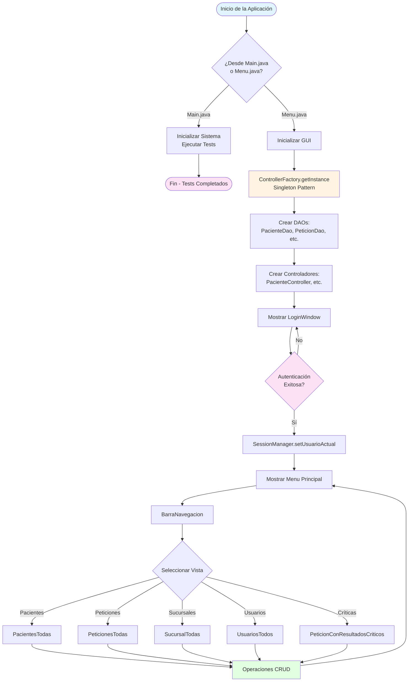
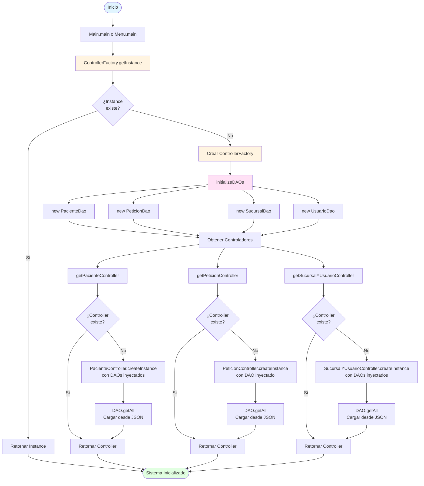
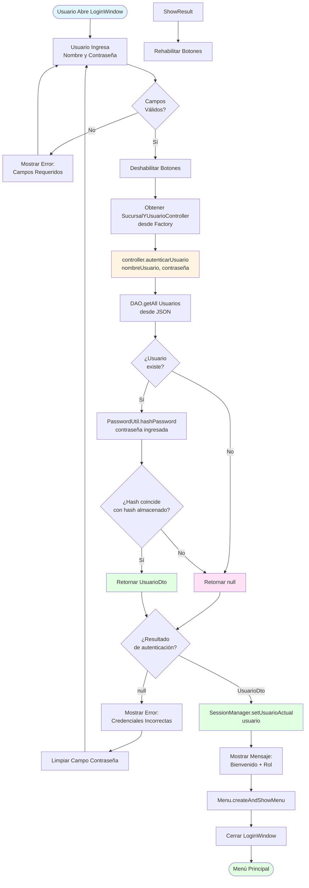
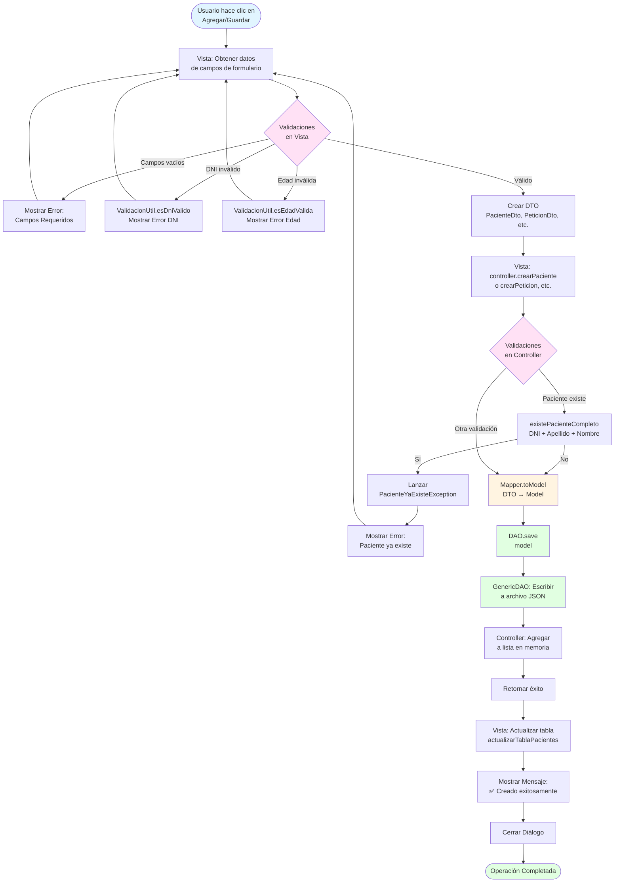
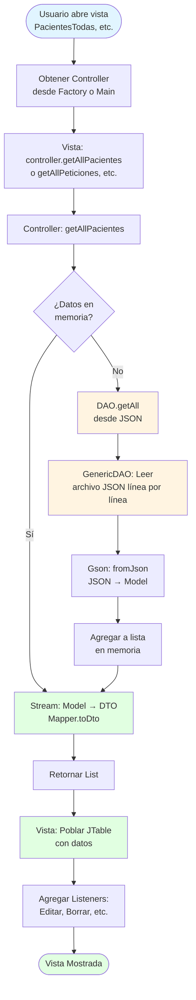
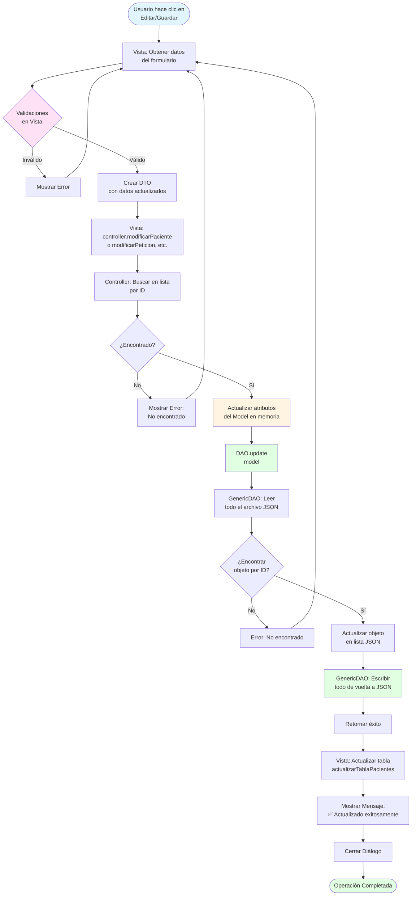
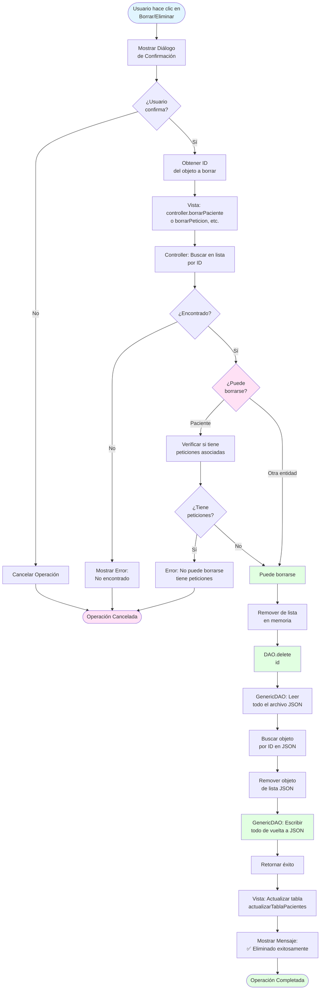
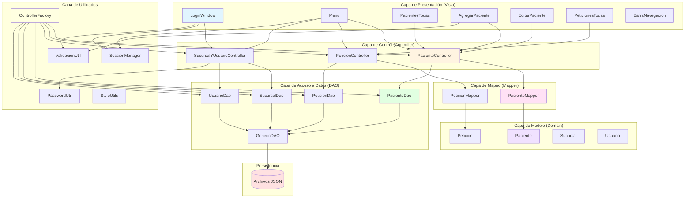

# 📊 Diagramas de Flujo del Sistema de Gestión de Laboratorio

Este documento contiene los diagramas de flujo completos del sistema, desde la inicialización hasta las operaciones CRUD.

---

## 📋 Índice

1. [Flujo General del Sistema](#flujo-general-del-sistema)
2. [Flujo de Inicialización](#flujo-de-inicialización)
3. [Flujo de Autenticación](#flujo-de-autenticación)
4. [Flujo de Operación CRUD (Crear)](#flujo-de-operación-crud-crear)
5. [Flujo de Operación CRUD (Leer)](#flujo-de-operación-crud-leer)
6. [Flujo de Operación CRUD (Actualizar)](#flujo-de-operación-crud-actualizar)
7. [Flujo de Operación CRUD (Eliminar)](#flujo-de-operación-crud-eliminar)
8. [Arquitectura de Capas](#arquitectura-de-capas)

---

## 🔄 Flujo General del Sistema

---

## 🚀 Flujo de Inicialización

---

## 🔐 Flujo de Autenticación

---

## ➕ Flujo de Operación CRUD (Crear)

---

## 📖 Flujo de Operación CRUD (Leer)

---

## ✏️ Flujo de Operación CRUD (Actualizar)

---

## 🗑️ Flujo de Operación CRUD (Eliminar)

---

## 🏗️ Arquitectura de Capas

---

## 📝 Notas Importantes

### Patrones Aplicados

1. **Singleton**: `ControllerFactory`, `SessionManager`, Controladores
2. **Factory**: `ControllerFactory` para crear controladores
3. **Dependency Injection**: Controladores reciben DAOs por constructor
4. **DAO Pattern**: Abstracción de acceso a datos
5. **DTO Pattern**: Separación entre Model y DTO
6. **Mapper Pattern**: Conversión entre Model y DTO

### Flujos de Datos

- **Vista → Controller**: DTOs
- **Controller → DAO**: Models
- **DAO → JSON**: Serialización con Gson
- **JSON → DAO**: Deserialización con Gson
- **DAO → Controller**: Models
- **Controller → Vista**: DTOs

### Manejo de Errores

- Excepciones personalizadas: `PacienteYaExisteException`
- Mensajes de error amigables al usuario
- Logging de errores en consola

